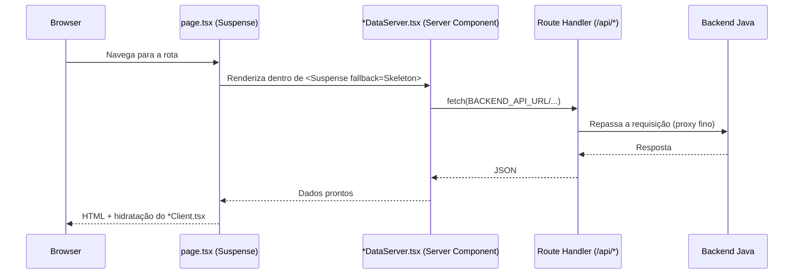

# Arquitetura — Visão Geral

## Componentes do sistema

```mermaid
flowchart LR
    User([Usuário / Navegador])
    FE[Frontend — Next.js\n(BFF Proxy)]
    BE[Backend — Spring Boot\n(API principal)]
    IA[Serviço de IA\n(Gemini)]
    DB[(PostgreSQL)]
    Discord[Bot Discord]
    Pay[Gateways de Pagamento\nStripe / MercadoPago]

    User -->|HTTPS| FE
    FE -->|Route Handlers| BE
    BE --> DB
    FE --> IA
    Discord -->|sync de conta| BE
    FE --> Pay
```

O frontend nunca fala diretamente com o backend a partir do navegador: toda chamada passa por um Route Handler Next.js (padrão **BFF Proxy**), documentado em detalhe em [ADR-0001](../adr/0001-bff-proxy-pattern.md).

## Fluxo de uma requisição de página com dados do backend



## Fluxo de pagamento com failover

```mermaid
flowchart TD
    Start[Usuário confirma pagamento] --> Router[payment-router.service.ts]
    Router --> Method{Método}
    Method -->|Cartão| Stripe1[Stripe]
    Method -->|PIX| MP1[MercadoPago]
    Method -->|Boleto| MP2[MercadoPago]
    Stripe1 -->|Erro retryable\n(timeout/5xx)| MP3[Fallback: MercadoPago]
    MP1 -->|Erro retryable| Stripe2[Fallback: Stripe]
    MP2 -->|Erro retryable| Stripe3[Fallback: Stripe]
    Stripe1 -->|Sucesso| Done[Assinatura confirmada]
    MP1 -->|Sucesso| Done
    MP2 -->|Sucesso| Done
    MP3 --> Done
    Stripe2 --> Done
    Stripe3 --> Done
```

Detalhes da lógica de failover (timeouts, erros que acionam fallback, incompatibilidade de tokens entre gateways) estão em [ADR-0002](../adr/0002-payment-gateway-failover.md).

## Documentação por componente

- [Arquitetura do Frontend](frontend.md) — stack, estrutura de pastas, rotas, camada de serviço, contextos e padrões de código.
